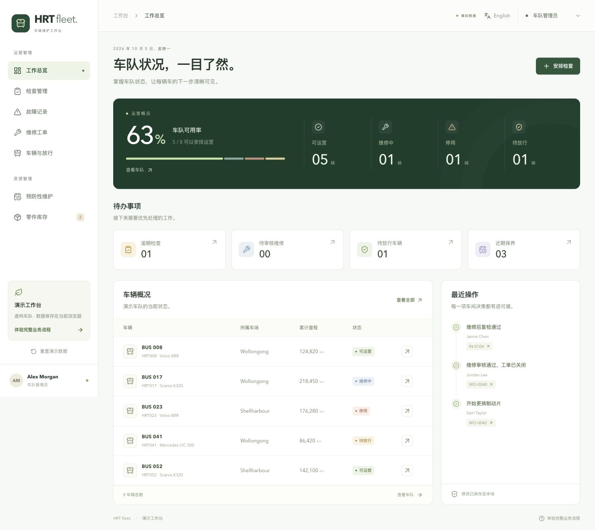

# HRT Fleet Maintenance

CSIT883 的车队维护与检查系统，做了一个网页原型。数据都是编的，存在浏览器 localStorage 里，没有后端。

用的是 React + TypeScript + Vite。

## 怎么跑

需要 Node 22 以上。

```sh
npm install
npm run dev
```

然后打开终端里显示的地址（一般是 http://127.0.0.1:5173）。

其他命令：

```sh
npm test        # 跑业务流程测试
npm run build   # 打包到 dist/
```

## 页面

- 工作总览：车辆状态统计、待办事项
- 检查管理：安排检查、填写检查结果，不通过会自动生成故障
- 故障记录：查看故障，从故障创建工单
- 维修工单：分配、维修、提交审核、退回、关闭，关闭后可以过账到财务
- 车辆：车辆档案的新增、编辑、停用，放行检查，模拟遥测同步
- 预防性维护：按日期、里程、发动机小时判断是否到期
- 零件库存：库存和补货

右上角可以切换中英文和角色（经理、检查员、维修技师、车间主管、外部承包商）。左侧的“重置演示数据”可以恢复初始数据。

演示日期固定为 2026-10-05。


